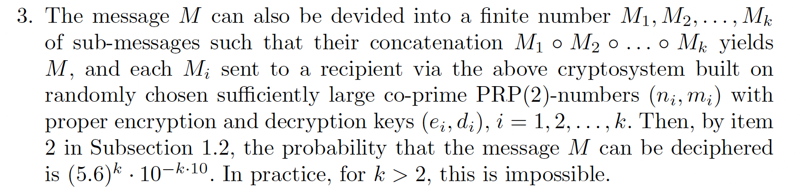

# Poor Men

### Description
**_I followed the description in the section 5.3 to implement the cryptosystem. However, my friend who is a crypto expert told me that there's something wrong about this, can you figure it out?_**

### Solution

We are provided with a data.txt file containing a list of public RSA keys and cs (Cipher String?) and a pdf file containing a research paper written on an RSA-type cryptosystem.

After reading through the document, we find that the only relevant part is Section 5 Point 3, where it states that 



Normaly this would be true, however, if the message that was encrypted turned out to be very short we can decrypt it with a brute force algorithm. We run through each character, encrypt it using the RSA public key given, then output the one that matches the ciphertext.

```

```
